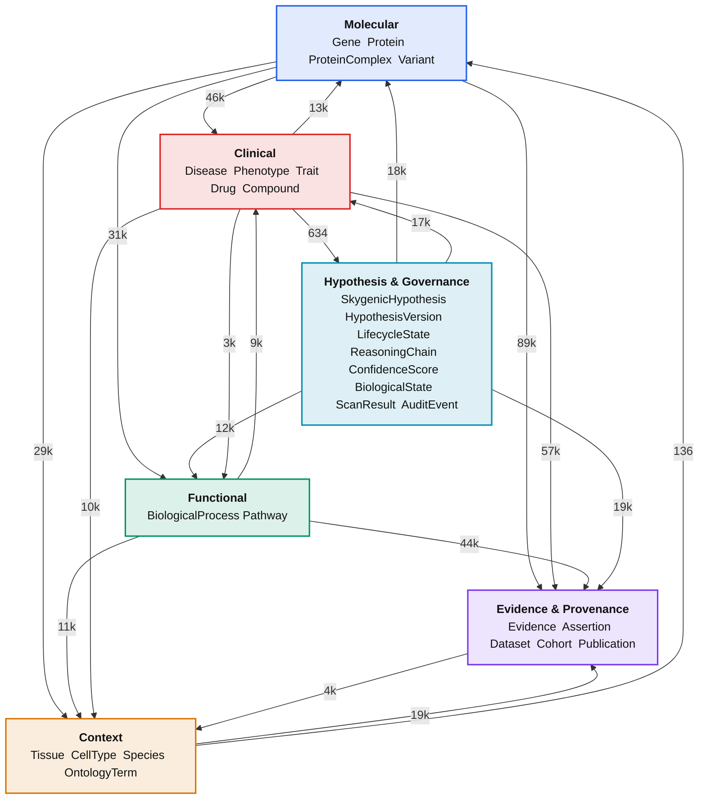
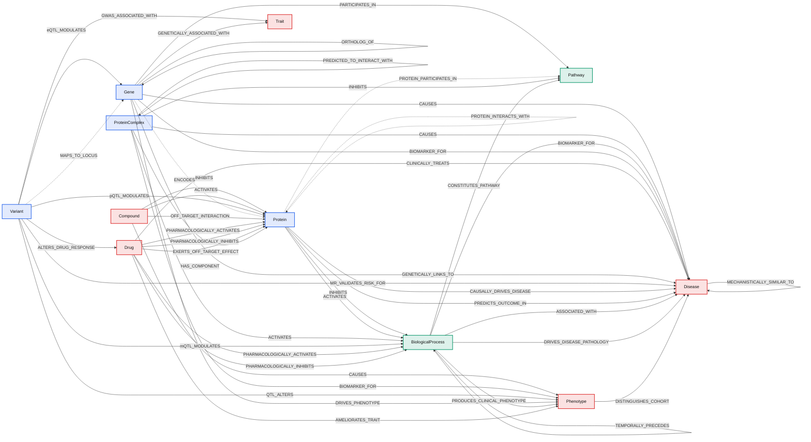
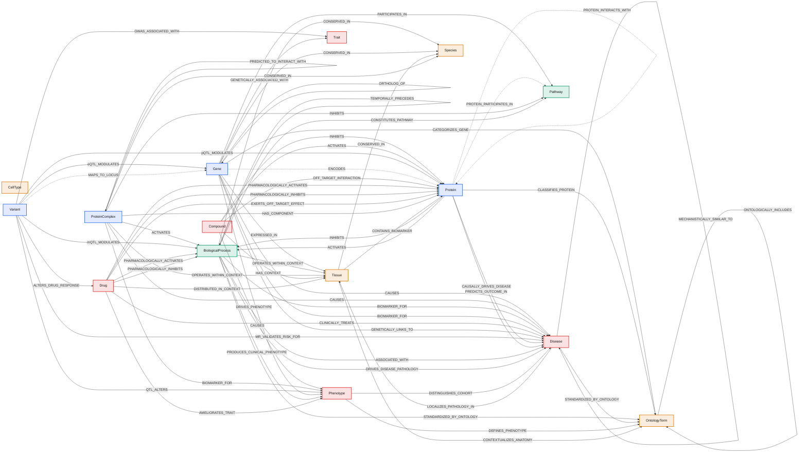
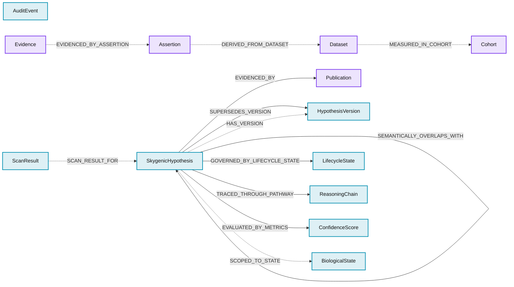

# Skygenic Graph — schema diagrams

> **Generated** by `python -m skygenic_scans.diagram` from
> `schema/ontology.yaml`. Do not hand-edit — regenerate instead, so a
> schema change shows up as a diff rather than a quietly wrong picture.

Schema **v2** · 28 node labels · 72 relationship types · 107 endpoint pairs (19 extension) · 31 retired

Edge labels show live counts from the generated graph where available.
Dotted arrows are `extension`-layer relationships — required by a primitive
but absent from the source schema document.

---

## 1. Subsystem overview

The four biological clusters plus the two operational ones. Numbers are
edge volumes between subsystems.



---

## 2. Biological core

The mechanism graph the scans actually traverse: molecular entities,
functional units and clinical endpoints.



---

## 3. Context and ontology

Anatomical, cellular and taxonomic context. **These are annotation, not
mechanism** — Tissue, Species and CellType are extreme hubs (mean degree
534, 392 and 316) and should be excluded from path-finding and
link-prediction projections.



---

## 4. Evidence, provenance and governance

The audit chain (`EVIDENCED_BY` → Publication, Assertion → Dataset →
Cohort) and the hypothesis lifecycle that the temporal scan layer operates on.



---

## Why not a rendered image

The graph holds ~53k nodes and ~234k edges. No diagram of the *instance*
data is readable or useful — it renders as a hairball. What is worth
drawing is the **schema**: 28 labels and 72 relationship types, which is
exactly what these diagrams show, generated from the schema file so they
cannot drift.

For instance-level exploration use Neo4j Browser at <http://localhost:7475>
with a bounded query, e.g.:

```cypher
MATCH p = (g:Gene {symbol:'TP53'})-[r]-(n)
WHERE r.is_synthetic = false
RETURN p LIMIT 100
```
